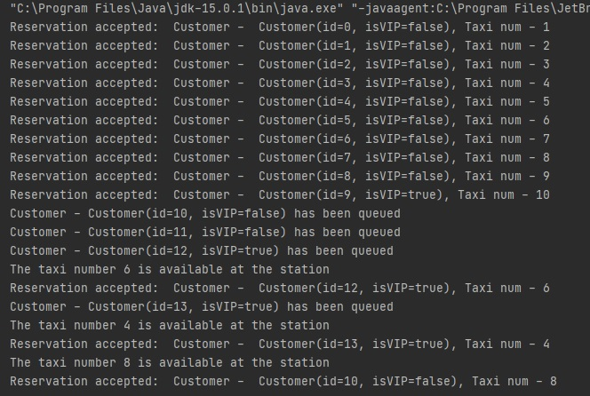

# TaxisStation
Create application that represents Taxi station with 10 taxies.  

Taxi station enables:  
·         Order taxi    
·         Cancel taxi  
·         Be aware when taxi gets available  

Person that orders a taxi may be regular customer or VIP customer.  
If a VIP orders a taxi, he/she should be first in line regardless the time he requested the service.  
Where no taxi is available, person should be kept on waiting list.  
When taxi becomes available, person according to priority gets the free taxi.  
Print to console every reservation accepted / queued.  
 
Execute:  

1. Create taxi station with 10 taxis    
2. Order taxi for 9 regular persons  
3. Order taxi for 1 VIP person  
4. Order taxi for 2 regular person   
5. Order taxi for 1 VIP person  
6. 1 Taxi is back in station  
7. Order taxi for 1 VIP person  
8. Second taxi is back in station   
9. Third taxi is back in station  

Output:  

